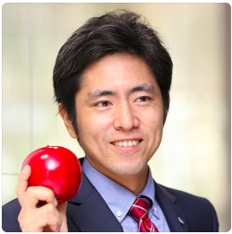

### Work Experience
#### 2018 - 現在　リサーチエンジニア, フリーランス/AGRAN合同会社　代表
- 茶生産管理省力化システムの開発
- 動物の心拍計測デバイスの精度評価
- 動物の分娩予兆モデルの開発
- 動物の在庫管理アプリの開発
- 製品事業計画/対応提案　　
- 動物の行動に関するTime Series Classification 課題の研究開発　　
  - 作業内容: 論文調査, 計画策定, 実施, 報告・提案　　
  - 言語/ライブラリ: Python, tslearn, multi-head attention, lightgbm 等　　
- 事業企画  
　- 作業内容: 事業企画書作成, 特許調査,　業務/データ分析, スケジュール作成
- RFIDを用いた識別アプリのプロトタイプ作成
  - 要求分析, 計画策定, 設計, 実装,　テスト, マニュアル作成
  - 言語/ライブラリ: GCP, firebase, Flutter, Dart, Kotlin
- 動物の行動予測アプリの設計と開発 
    - 言語/ライブラリ: Python, scikit-learn, pytorch, tensorflow, pandas, dash, flask, GCP(BigQuery, Pub/Sub, Cloud Run, Cloud  Build, Vision), Caffe  
- 動物の行動識別モデルの設計と開発  
- 時系列クラス分類 ( Xgboost, LSTM, etc )  
- 行動識別( NN with Opticalflow )  
- 姿勢識別 (Wide ResNet, etc)  
- 個体識別 ( Parameter-free Spacial Attention Net, etc)  
- 動物検出 ( Faster R-CNN, etc )  
  
#### 2017 - 2018 リサーチエンジニア, R＆D事業本部＠キヤノンITソリューションズ  
- 動物の行動識別モデルの研究開発 
- 映像を用いた行動識別  
- 映像を用いた複数の動物の追跡   
  
#### 2016 - 2017 イントレプレナー, 経営企画＠キヤノンITソリューションズ  
- 事業計画の策定とマーケットテストの実施   
- 酪農・畜産農家向けソリューションの実証実験  
  
#### 2007 - 2016 プロジェクトリーダー, キヤノンソフトウエア  
- 組織間のワークフローの調整・定義  
- 共通ライブラリのリリース用ツールの設計と開発 (Ruby)  
- プリンタ向けインストーラの設計と開発 (C++, Java)  
- プリンタ同梱アプリの開発(C++)  
  
#### 2006 - 2007 システムエンジニア, アスキーソリューションズ  
- カラオケや銀行システムの開発   
  
#### 2002 - 2006 プロダクトマネージャー, gsport, Inc.  
- ソフトウエアモーションキャプチャーソフトの計画策定と実施  
- ピッチングマシーンや上肢リハビリシステムの設計と開発  
  
#### 2001 - 2002  リサーチアシスタント, 高度三次元動画像遠隔表示プロジェクト  
- 三次元テレビの研究開発  
  
### Education  
千葉大学、千葉、日本 ー 学士( 画像工学)2001  

### Award  
- 優秀論文賞「超多眼立体画像に対する輻輳・調節・瞳孔反応」3次元画像カンファレンス2001  
 
### Publication   
- 画像ラボ2005年9月号 映像から三次元アニメを作るソフト  
- 画像ラボ2003年4月号 影光学系扇型配列方式(FAPO方式)立体ディスプレイの開発  
 
### Registered Patents  
- 特許7026893 動作監視システム特許 (防霜ファン動作監視システム）
- 特許6959495 情報処理装置、情報処理方法、プログラム(牛の発情発見システム）

### Private Project
- 戸塚めぐりアプリ(Android/iOS, js) 横浜市戸塚区と街歩きイベントを開催, 2014
- 古民家めぐりアプリ(Android, js)  古民家再生協会関東地区会員大会にて発表, 2014
